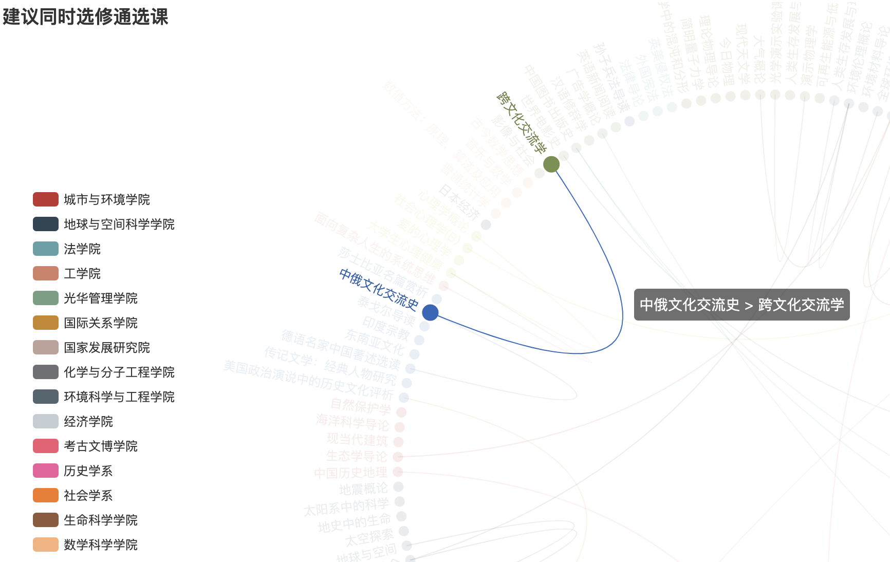

### Guide for Selecting Elective Courses at Peking University

##### Data Source

The data for this guide is obtained from the website of the Dean's Office of Peking University (http://www.dean.pku.edu.cn/). The publicly available data used is from the academic year 2020-2021 and includes information on undergraduate open courses.

##### Target Audience

Undergraduate students at Peking University who need guidance in selecting elective courses.

##### Goal

This guide aims to provide advice and guidance for course selection based on the perspectives that undergraduate students are commonly concerned about when choosing courses. These perspectives include course categories, course ratings, assessment methods, and course similarity.

